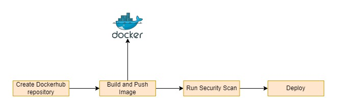

# A Hello World Spring Boot App

# Pipeline Diagram

## Workflows
There are total 3 workflows
1. `create_repository.yaml`
   1. This is first workflow that gets executed when the code is pushed to `master` branch
   2. It creates the docker hub repository using terraform.
   3. terraform code resides under `terraform` directory at the root level
2. `build.yml`
   1. This workflow gets executed when `Create dockerhub repository` workflow succeeds.
   2. Builds docker image
   3. Push docker image to dockerhub
3. `security_scan.yaml`
   1. This workflow gets executed when `Build and Push` workflow succeeds.
   2. Runs vulnerability scan for the uploaded image

## Deployment
Once image is uploaded, we now need to deploy and test the solution. To deploy the solution, kindly refer to `scripts/deploy.sh` script. 
Pre-requisites for deployment
1. `docker` -> in started state
2. `curl`
3. `bash shell`

### Execution step
1. Run `cd scripts && chmod +x deploy.sh && ./deploy.sh` 
2. `curl http://localhost:8080` => should return Hello World response

# Note
jib build is failing for some reason, didn't have much chance to investigate into more details due to time crunch. I have commented that particular workflow. 